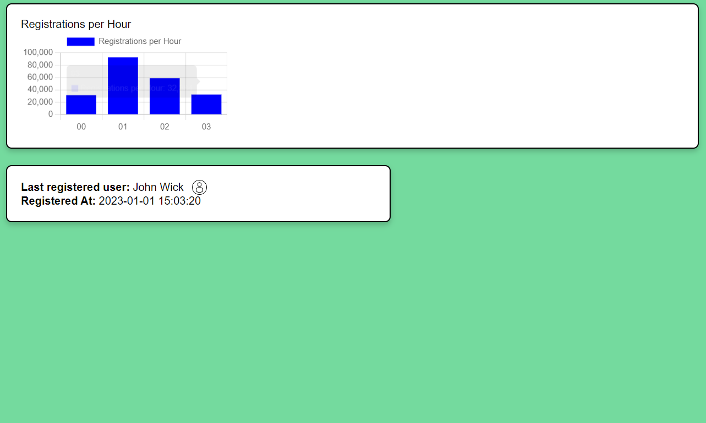

# tree nation

```
yarn install
yarn serve
```

Some comments:

 - The building of this demo relied heavily on the assistance of chat GPT. 
 - The PHP file is added on this repo root folder. What is requested is a simple server that would read from the DB and return the data.

It should look like this:



